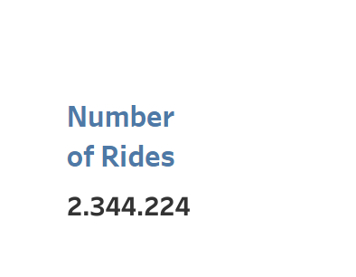
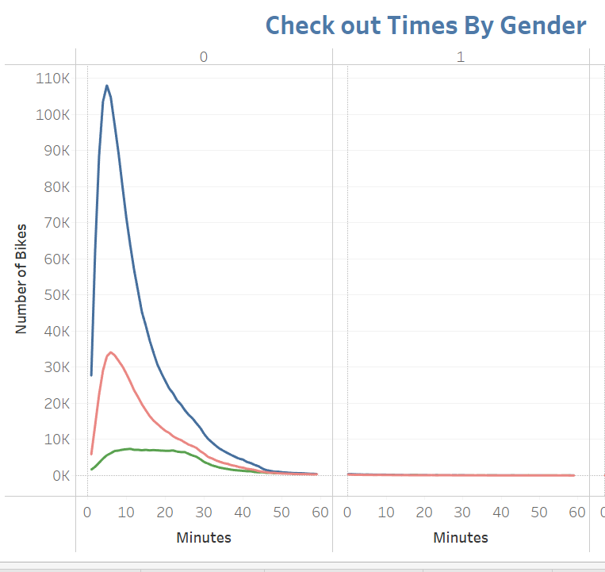
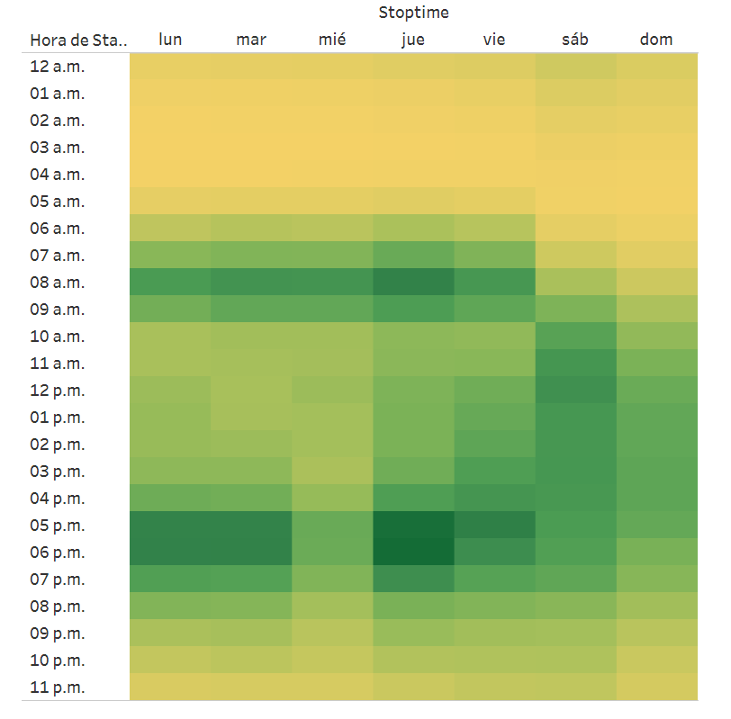
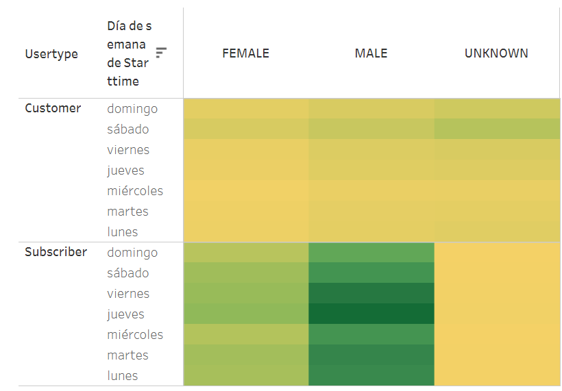

# bikesharing
## Overview of Project 
### Purpose
The purpose of this project is to create an original visualization about a Citi Bike NYC business, using a popular software named Tableau, and induce the investors to do something similar in Des Moines.

## Results 

Starting the visualization we can observe that the total number of rides is 2.344.224  during the month of August. This means the total of trips analyzed but it doesn't mean that every bike was used the same number of times, so we add a chart to observe the bikes more used with the ID, then also we can observe the start station more used, to identify which order the bikes will need the maintenance. 

In this chart we can observe the trip duration that the bikes are used by gender, as we know the males use more the bikes than the females, there is a big difference, also we can observe that less than an hour is the duration of a trip, this means the bikes are using a small time per trip, this information tells us that having enough bikes during the peak hours, then we don´t need more, because the bikes are sharing all the time in less than an hour.

In this chart, we can see that the days that most start the trip is during the week Monday to Friday and the most popular, in the morning between 7:00 and 9:00 am, and in the afternoon between 5:00 and 7:00 pm, this could be related with the office hours and schools scheduled, also we can see that Saturday and Sunday the most popular hours are between 9:00 am and 5:00 pm, probably they use the bike for personal stuff and there is no a defined scheduled. 

In this last chart, we can observe that the customers use more bike-sharing on Saturdays, but the subscriber use it more, and males use it all the days of the week specifically, Thursday and Friday.  

### Summary
Finally, Identifying the time that most customers and subscribers use the bikes, will help the investors to take the decision and start the program of bike-sharing, based on the scheduled and the use of the bikes is a good business and also will have good impact on the natural environment, also to sum to this analysis will be helpful is we create another visualization about the top end station, this will help the company to now where the people are going, maybe a specific company or companies or students, which people? the subscribers or customers, having this visualization will be helpful.

In the next link you can see the complete visualization
------
[link to dashboard](https://public.tableau.com/app/profile/alejandra6221/viz/CitiBikeNYC_16496475299900/Historia1)
